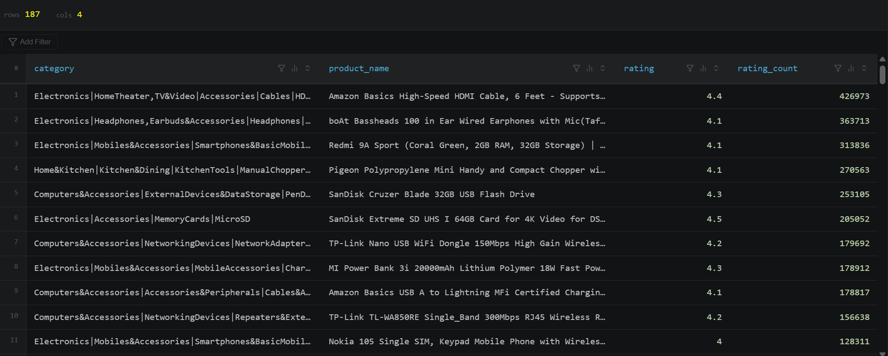
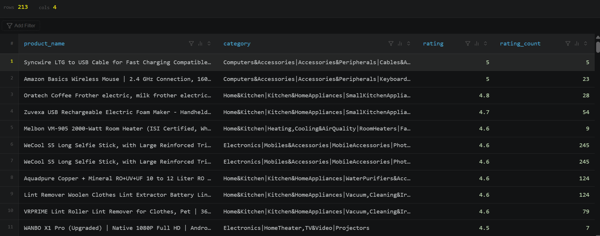
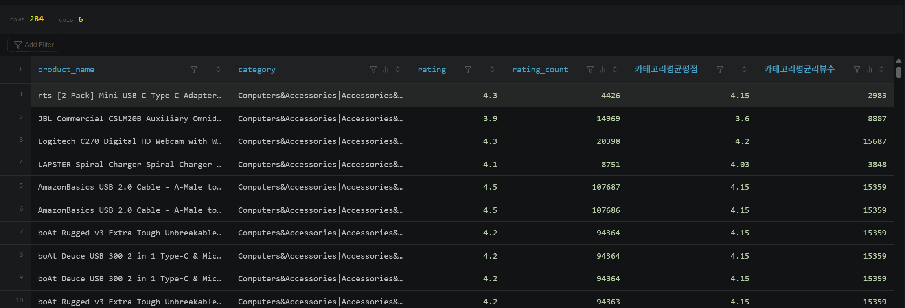
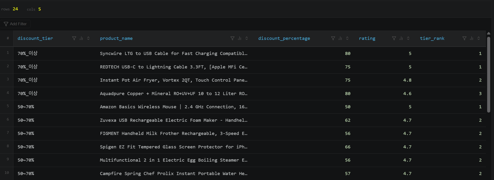
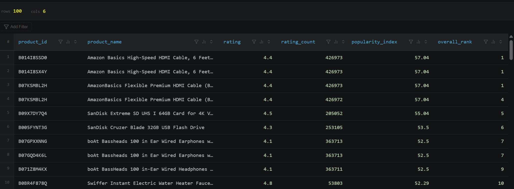

# D+34 [과제] Amazon 데이터셋 기반 추천 시스템 설계하기

생성일: 2026년 9월 1일 오후 5:25
최종 편집 일시: 2026년 9월 3일 오전 12:45
작성자: 서진
상태: 시작 전

[[DI 1기] PBL 2. 서비스 분석 (2)](https://app.notion.com/p/DI-1-PBL-2-2-aef06894f5668335afd30118717db4fa?pvs=21)

#### 

---

# 클리닝 테이블 만들기 — 0

- Amazon 데이터셋은 `discounted_price`(₹399.00), `discount_percentage`(64%), `rating_count`(24,269)처럼 **숫자에 기호가 섞인 텍스트**로 되어 있어서, 계산이나 정렬을 하려면 먼저 클리닝(CAST)이 필요.
- `rating` 컬럼에 `|` 로 적힌 행이 1개 있어 NULL로 변환 위해 CAST가 아닌 TRY_CAST 사용

```jsx
CREATE OR REPLACE TABLE project_name.dataset_name.amazon_clean AS
SELECT
  product_id,
  product_name,
  category,
  TRY_CAST(REPLACE(REPLACE(discounted_price, '₹',''), ',', '') AS DECIMAL(12,2)) AS discounted_price,
  TRY_CAST(REPLACE(REPLACE(actual_price, '₹',''), ',', '') AS DECIMAL(12,2)) AS actual_price,
  TRY_CAST(REPLACE(discount_percentage, '%','') AS DECIMAL(5,2)) AS discount_percentage,
  TRY_CAST(rating AS DECIMAL(3,2)) AS rating,
  TRY_CAST(REPLACE(rating_count, ',', '') AS BIGINT) AS rating_count,
  user_id
FROM project_name.dataset_name.amazon;
```

---

# 추천 시스템 — 1

**1. 추천 시스템 이름**
➜ **"이 카테고리 첫 구매는 이걸로 시작하세요"**

**2. 추천 시스템의 테마: 추천 시스템의 고유 컨셉에 대한 설명**
➜  처음 접하는 카테고리에서는 선택지가 너무 많아 오히려 고르기 어렵습니다. 그래서 카테고리마다 딱 한 개, 가장 많은 사람이 이미 검증한 상품만 골라 보여주려고 합니다. 각 카테고리 안에서 리뷰 수가 가장 많은 상품 1개씩을 뽑되, 최소한의 품질 기준으로 평점 4.0 이상인 상품 중에서만 고릅니다. 이렇게 하면 "이 카테고리에서 뭘 사야 할지 모르겠다"는 고객에게 카테고리별 대표 상품 하나씩을 안심하고 추천할 수 있습니다.

**3. 구현 로직: SQL 쿼리 설명 및 주요 로직 설명**
➜ 각 카테고리에서 리뷰 수, 그 다음으로 리뷰 평점이 높은 순으로 순위를 정함. 
➜ RANK() 함수를 사용했더니  카테고리 안에서 `rating_count`가 정확히 똑같은 상품이 3개 있어서 `ROW_NUMBER()` 사용.

```jsx
WITH ranked AS (
SELECT
product_id, product_name, category, rating, rating_count,
ROW_NUMBER() OVER (
PARTITION BY category
ORDER BY rating_count DESC, rating DESC, product_id
) AS rnk
FROM project_name.dataset_name.amazon_clean
WHERE rating >= 4.0
)
SELECT category, product_name, rating, rating_count
FROM ranked
WHERE rnk = 1
ORDER BY rating_count DESC;
```

**4. 결과**: 

!

카테고리마다 딱 한 행씩만 남습니다. 리뷰 수가 가장 많은 상품이 그 카테고리의 대표로 뽑히는 구조라, 실행하면 "결과 행 수 = 카테고리 개수"가 됩니다. 
또한 결과 행수는 187행이지만, 카테고리의 전체 고유행수는 211개입니다. 
즉, 211-187=24개의 카테고리엔 평점 4.0 이상 상품이 하나도 없다는 뜻이 됩니다.

---

# 추천시스템 — 2

**1. 추천 시스템 이름**
➜ **"아직 아무도 모르는 꿀템이에요"**

**2. 추천 시스템의 테마: 추천 시스템의 고유 컨셉에 대한 설명**
➜  리뷰 수가 적다고 해서 품질이 나쁜 건 아닙니다. 오히려 아직 알려지지 않았을 뿐인 좋은 상품일 수 있습니다. 그래서 전체 상품을 리뷰 수 기준으로 4구간(하위 25%, 중하위, 중상위, 상위 25%)으로 나눈 뒤, **리뷰 수가 하위 25%에 속하면서도 평점은 4.3 이상인 상품만 뽑아 추천**합니다. 리뷰는 적지만 실제로 사본 사람들의 만족도는 높은, "발굴 가치가 있는" 상품 목록을 보여줌으로써 유행템 말고 남들보다 먼저 좋은 물건을 찾고 싶은 고객에게 재미를 줍니다.

**3. 구현 로직: SQL 쿼리 설명 및 주요 로직 설명**
➜ NTILE(4) 로 리뷰가 적게 달린 1분위를 구하고, 평점은 4점 이상인 제품을 추천.
➜ 평점 4점 / 4.3점 고민을 많이 했는데, 4점 이상인 경우가 대체적으로 좋다고 평가를 하기에 기준으로 잡음.

```jsx
WITH tiered AS (
SELECT
product_id, product_name, category, rating, rating_count,
NTILE(4) OVER (ORDER BY rating_count ASC) AS review_tier
FROM project_name.dataset_name.amazon_clean
)
SELECT product_name, category, rating, rating_count
FROM tiered
WHERE review_tier = 1 AND rating >= 4.0
ORDER BY rating DESC;
```

**4. 결과**: 



카테고리 별로 리뷰 수가 차이가 상당히 납니다. 결과 행수는 213개, 너무 적게 나오면 평점 기준(4.0)을 3.5 정도로 낮춰서 개수를 조절할 수 있었지만, 하지 않아도 충분할 것 같습니다. 객관적인 평가를 좀 더 원한다면 옆의 rating_count를 비교하며 선택하면 좋을 것 같습니다.

---

# 추천시스템 — 3

**1. 추천 시스템 이름**
➜ **"이 카테고리에선 이게 평균 이상이에요"**

**2. 추천 시스템의 테마: 추천 시스템의 고유 컨셉에 대한 설명**
➜  평점 4.5라는 숫자도 카테고리에 따라 의미가 다릅니다. 어떤 카테고리는 전체적으로 평점이 후한 반면, 어떤 카테고리는 평점이 짜게 나오는 경향이 있을 수 있기 때문입니다. 그래서 **카테고리별 평균 평점과 평균 리뷰 수를 먼저 계산**하고, 그 평균을 모두 웃도는(**평점도 평균 이상, 리뷰 수도 평균 이상인) 상품만 골라 추천**합니다. 이렇게 하면 카테고리마다 다른 기준선을 반영해서, "**이 카테고리 안에서는 확실히 잘 나가는 상품**"만 상대적으로 걸러낼 수 있습니다.

**3. 구현 로직: SQL 쿼리 설명 및 주요 로직 설명**
➜ 카테고리별 평균 평점, 평균 리뷰수를 먼저 CTE 계산
➜ 이후 평점 평균 이상, 리뷰 수 평균 이상 둘 다 만족하는 제품 선별

```jsx
WITH scored AS (
  SELECT
    product_name,
    category,
    rating,
    rating_count,
    ROUND(AVG(rating) OVER (PARTITION BY category), 2) AS 카테고리평균평점,
    ROUND(AVG(rating_count) OVER (PARTITION BY category), 0) AS 카테고리평균리뷰수
  FROM project_name.dataset_name.amazon_clean
)
SELECT *
FROM scored
WHERE rating > 카테고리평균평점 AND rating_count > 카테고리평균리뷰수
ORDER BY category, rating_count DESC;
```

**4. 결과**: 



카테고리별 평균의 차이가 생각보다 많이 납니다. (3.4 - 4.47) 또한 "평균보다 나은" 상품만 남기 때문에, 카테고리별로 결과 개수가 들쭉날쭉합니다. 상품이 몰려있는 대형 카테고리(예: 케이블, 액세서리류)에서는 통과하는 상품이 많이 나오고, 상품 수가 적은 니치 카테고리에서는 상대적으로 적은 결과값이 나왔습니다.

---

# 추천시스템 — 4

**1. 추천 시스템 이름**
➜ **"지금 놓치면 아까운 특가 TOP 3"**

**2. 추천 시스템의 테마: 추천 시스템의 고유 컨셉에 대한 설명**
➜  할인율이 높다고 무조건 좋은 건 아니고, 할인율이 애매하게 낮은데 품질도 애매한 상품은 오히려 매력이 떨어집니다. 그래서 **할인율을 70% 이상 / 50~70% / 30~50% 세 구간으로 나눈 뒤, 각 구간 안에서 평점이 높은 순으로 우선순위를 매겨 1위부터 3위까지만 추천**합니다. 특히 할인율 50% 이상이면서 평점 4.0 이상인 상품을 최우선으로 노출해서, "얼마나 세일 중인지"와 "사도 후회 없는지"를 동시에 확인할 수 있는 특가 리스트를 제공합니다.

**3. 구현 로직: SQL 쿼리 설명 및 주요 로직 설명**
➜ 할인율 구간을 나누기 위해 CTE 사용
➜ 이후 할인구간마다, 그 안에서 평점이 제일 높은 상품을 순위로 정렬
➜ 1위~3위만 표시하도록 tier_rank <= 3 조정

```jsx
WITH tiered AS (
  SELECT
    product_id, product_name, discount_percentage, rating,
    CASE
      WHEN discount_percentage >= 70 THEN '70%_이상'
      WHEN discount_percentage >= 50 THEN '50~70%'
      ELSE '30~50%'
    END AS discount_tier
  FROM project_name.dataset_name.amazon_clean
  WHERE discount_percentage >= 30
),
ranked AS (
  SELECT
    discount_tier, product_name, discount_percentage, rating,
    DENSE_RANK() OVER (PARTITION BY discount_tier ORDER BY rating DESC) AS tier_rank
  FROM tiered
)
SELECT *
FROM ranked
WHERE tier_rank <= 3
ORDER BY discount_tier desc, tier_rank;
```

**4. 결과**: 



간단하게 표시하기 위해 TOP 3으로 제한을 두었더니 24행 밖에 나오지 않았습니다. TOP 5로 늘려도 괜찮을 것 같습니다. 또한 70% 할인하는 상품은 적게 표시되었고, "상위 3위" 를 추려냈지만 `DENSE_RANK`를 썼기 때문에 같은 평점 처리로 인해 구간별 상품 개수가 다르게 나왔습니다. 또한 ‘70% 이상 파격 할인 구간에는 평점이 낮은 상품을 할인해서 팔 것이다’ 라고 예상했지만, “파격 할인 구간에도 평점 5.0짜리 상품이 있다” 라는 인사이트를 얻을 수 있었습니다.

---

# 추천시스템 — 5

**1. 추천 시스템 이름**
➜ **"요즘 진짜 잘 나가는 상품 총정리 100"**

**2. 추천 시스템의 테마: 추천 시스템의 고유 컨셉에 대한 설명**
➜ 리뷰 3개짜리 상품이 우연히 평점 5.0을 받는 경우처럼, 평점만으로는 착시가 생길 수 있습니다. 그래서 **평점과 리뷰 수를 함께 곱하는 방식**으로(리뷰 수가 많을수록 가중치가 붙는 로그 스케일 계산) 종합 인기 지수를 만들고, 이 지수를 기준으로 전체 상품 순위를 매겨 **상위 100개를 추천**합니다. "**평점도 좋고 실제로 많은 사람에게 검증까지 된**" 상품만 종합적으로 걸러내는, 신뢰도 높은 총정리 랭킹입니다.

**3. 구현 로직: SQL 쿼리 설명 및 주요 로직 설명**
➜ `rating × LN(rating_count + 1)`로 평점과 리뷰 수(로그로 완만하게)를 곱해 "품질 + 검증 규모"를 함께 반영하는 인기 지수를 계산
➜ +1은 `LN(0)`은 마이너스 무한대이라서,  `rating_count`가 0이면 에러.
➜  `rating_count + 1`을 해주면 최소 `LN(1) = 0`이 보장

```jsx
SELECT
  product_id, product_name, rating, rating_count,
  ROUND(rating * LN(rating_count + 1), 2) AS popularity_index,
  RANK() OVER (ORDER BY rating * LN(rating_count + 1) DESC) AS overall_rank
FROM project_name.dataset_name.amazon_clean
ORDER BY overall_rank
LIMIT 100;
```

**4. 결과**: 



평점 5.0짜리가 1위가 아니고, 4.4점이 1위. 즉 `LN(rating_count+1)`이 리뷰 수에 대한 가중치가 잘 적용이 된 것 같습니다.
그리고 상위권에 HDMI 케이블, SD카드, USB, 이어폰처럼 **범용 전자 액세서리**가 몰려 있습니다. 아무래도 리뷰 수가 누적됐기에 상위권에 포함된 것 같습니다. 또한 1~3위가 지수(57.04),  `rating_count`가 426973 다 동일합니다. 이건 동일한 상품을  **product_id로 중복 등록**되어 있는 경우 같습니다.